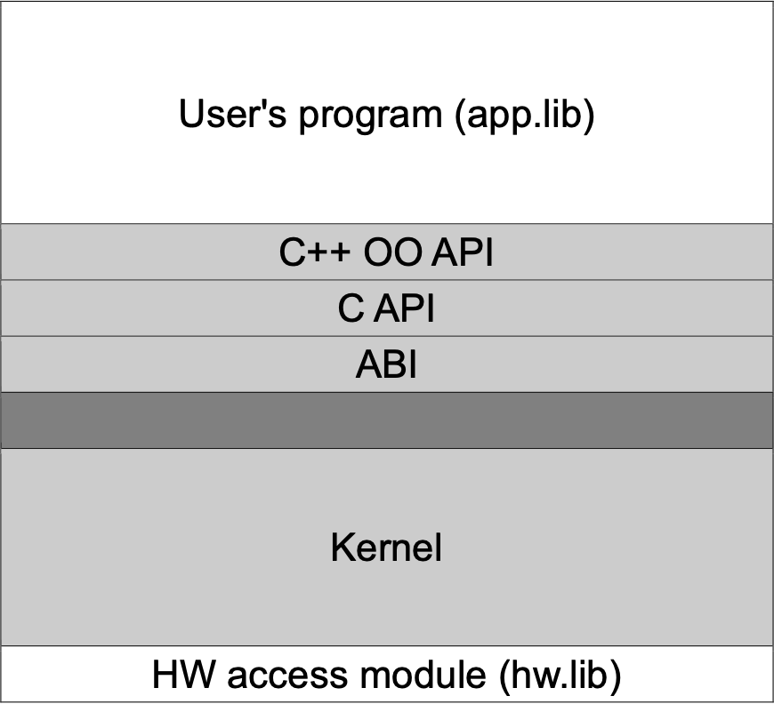

# Minimal Operating System Based on Xv6 (RISC-V Architecture)

## Special Thanks
* I would like to thank @Nix0712 for making a great Readme.md file for this project. I altered it a bit, but a lot of the original document is published by him. Check out his
[GitHub](https://github.com/Nix0712).

## Description

* Small time-sharing OS which provides multithreading and memory allocation based on the Risc-V architecture, emulated by QEMU emulator. This was a school project at the Faculty Of Electrical Engineering in Belgrade, Serbia for the year 2023/2024.

## Table of Contents

1. [Installation](#installation)
2. [Usage](#usage)
3. [About](#about)
4. [Sources](#sources)


## Installation

### Arch Linux
### Install Dependencies and QEMU

1. Install the RISC-V toolchain and QEMU emulator:

   ```bash
   sudo pacman -U https://archive.archlinux.org/packages/r/riscv64-linux-gnu-gcc/riscv64-linux-gnu-gcc-8.3.0-1-x86_64.pkg.tar.xz
   sudo pacman -U https://archive.archlinux.org/packages/r/riscv64-linux-gnu-binutils/riscv64-linux-gnu-binutils-2.32-1-x86_64.pkg.tar.xz
   sudo pacman -S qemu-full qemu-base make
   ```

2. To prevent `pacman` from updating the RISC-V packages, add the following code to your `/etc/pacman.conf` file:

   ```bash
   IgnorePkg = riscv64-linux-gnu-gcc
   IgnorePkg = riscv64-linux-gnu-binutils
   ```

### Open in a Preconfigured Virtual Machine

Description: The virtual machine has been preconfigured and designed to ensure that all students can replicate the project setup without issues.

You can access the virtual machine using the link provided by the [university](https://www.etf.bg.ac.rs/):

**Note: The files provided are compatible with VMware 17.**

[Access Virtual Machine](https://drive.google.com/file/d/1edGYFcvdnV0pbKws_1G1vePtEec0qC0G/view)

*Note: This link points to the project for the current academic year (2023/24) and may not be accessible in the future.*

### Debugging Setup

For debugging, you need to install `riscv64-elf-gdb`:

```bash
sudo pacman -S riscv64-elf-gdb
```

## Usage 

### Starting the OS

To run the project with the default tests, simply use the following command:

```bash
make qemu
```

This will execute the predefined tests located in the `test` folder.

If you'd like to run custom tests, you can remove or modify the default test cases and create your own. Your custom test's main function should be named `userMain()`.

---

### How to Debug

To debug the project, follow these steps:

1. **Start QEMU in Debug Mode**  
   Run the following command to launch QEMU in debugging mode:

   ```bash
   make qemu-gdb
   ```

2. **Note the Debugging Port**  
   Once the build completes, you'll see a message similar to this:

   ```bash
   *** Now run 'gdb-multiarch' in another window with target remote args 'localhost:26000'.
   qemu-system-riscv64 -machine virt -bios none -kernel kernel -m 128M -smp 1 -nographic -S -gdb tcp::26000
   ```

   The important part is `localhost:[PORT_NUMBER]`. In this example, the port is `26000`, but it may vary in your case.


3. **Launch GDB**  
   In another terminal, start the GDB debugger by running:

   ```bash
   riscv64-elf-gdb
   ```

4. **Connect GDB to QEMU**  
   Connect GDB to QEMU using the port number noted earlier:

   ```bash
   target remote localhost:[PORT_NUMBER]
   ```

At this point, you can use GDB to debug the project. For more information on using GDB, refer to these resources:

- [GDB Step-by-Step Introduction](https://www.geeksforgeeks.org/gdb-step-by-step-introduction/)
- [Official GDB Documentation](https://www.sourceware.org/gdb/documentation/)

That's it! You're all set to debug your project.

**Note that you can clean the build**
```bash
make clean
```

## About

### Kernel interface



### C API


| Code   | Function Signature                                          | Description                                                                                           |
|--------|-----------------------------------------------------------|-------------------------------------------------------------------------------------------------------|
| 0x01   | `void* mem_alloc(size_t size);`                           | Allocates at least `size` bytes of memory, aligned to `MEM_BLOCK_SIZE`. Returns a pointer or NULL on failure. |
| 0x02   | `int mem_free(void* ptr);`                                | Frees memory allocated by `mem_alloc`. Returns 0 on success or a negative error code on failure.    |
| 0x11   | `class _thread; typedef _thread* thread_t; int thread_create(thread_t* handle, void(*start_routine)(void*), void* arg);` | Creates a thread running `start_routine` with `arg`. Returns 0 on success and a negative error code on failure. |
| 0x12   | `int thread_exit();`                                      | Terminates the calling thread. Returns a negative error code on failure.                            |
| 0x13   | `void thread_dispatch();`                                 | Potentially yields the processor from the current thread to another.                                 |
| 0x21   | `class _sem; typedef _sem* sem_t; int sem_open(sem_t* handle, unsigned init);` | Creates a semaphore with an initial value. Returns 0 on success and a negative error code on failure. |
| 0x22   | `int sem_close(sem_t handle);`                           | Releases the semaphore. Returns 0 on success and a negative error code on failure.                  |
| 0x23   | `int sem_wait(sem_t id);`                                | Wait operation on the semaphore. Returns 0 on success and a negative error code on failure.         |
| 0x24   | `int sem_signal(sem_t id);`                              | Signal operation on the semaphore. Returns 0 on success and a negative error code on failure.       |
| 0x25   | `int sem_timedwait(sem_t id, time_t timeout);`          | Waits on the semaphore with a timeout. Returns 0 on success, SEMDEAD on semaphore deallocation, or TIMEOUT on timeout. |
| 0x26   | `int sem_trywait(sem_t id);`                             | Tries to wait on the semaphore without blocking. Returns 0 if locked, 1 if unlocked, or a negative error code on failure. |
| 0x31   | `typedef unsigned long time_t; int time_sleep(time_t);` | Suspends the calling thread for a specified period. Returns 0 on success and a negative error code on failure. |
| 0x41   | `const int EOF = -1; char getc();`                       | Reads a character from the input buffer. Suspends the thread if the buffer is empty. Returns the character or EOF on error. |
| 0x42   | `void putc(char);`                                       | Outputs a character to the console.                                                                   |

### C++ API

| Class          | Member Function                               | Description                                                                                 |
|----------------|----------------------------------------------|---------------------------------------------------------------------------------------------|
| **Thread**      | `Thread(void (*body)(void*), void* arg);`   | Constructor that initializes a thread with a function and its argument.                   |
|                | `virtual ~Thread();`                          | Destructor for the `Thread` class.                                                         |
|                | `int start();`                                | Starts the thread execution.                                                               |
|                | `static void dispatch();`                     | Yields the processor from the current thread.                                             |
|                | `static int sleep(time_t);`                   | Puts the calling thread to sleep for a specified duration.                                 |
|                | `virtual void run();`                         | Virtual function to be overridden for custom thread behavior.                              |
|                | `static void runWrapper(void* obj);`         | Private static method that invokes the `run()` method on the thread object.               |
| **Semaphore**   | `Semaphore(unsigned init = 1);`              | Constructor that initializes a semaphore with a given value (default is 1).               |
|                | `virtual ~Semaphore();`                       | Destructor for the `Semaphore` class.                                                     |
|                | `int wait();`                                 | Waits for the semaphore to become available.                                              |
|                | `int signal();`                               | Signals the semaphore to release waiting threads.                                         |
|                | `int timedWait(time_t);`                      | Waits on the semaphore with a timeout.                                                    |
|                | `int tryWait();`                             | Attempts to wait on the semaphore without blocking.                                       |
| **PeriodicThread** | `void terminate();`                        | Terminates the periodic thread.                                                            |
|                | `PeriodicThread(time_t period);`             | Constructor that initializes a periodic thread with a specified period.                   |
|                | `virtual void periodicActivation();`         | Virtual function for periodic activation behavior (to be overridden).                      |
|                | `virtual void run() override;`               | Overrides the `run()` method to include periodic behavior.                                 |
| **Console**     | `static char getc();`                         | Reads a character from the input buffer.                                                  |
|                | `static void putc(char);`                    | Outputs a character to the console.                                                       |

---

## Sources

### RISC-V Specifications

RISC-V is an open standard instruction set architecture (ISA) that allows for a wide range of applications in computer architecture. The RISC-V specifications define various aspects of the architecture, including instruction formats, privilege levels, memory management, and more.

For detailed information regarding the RISC-V specifications, including the various versions and extensions, please refer to the official RISC-V Technical Specifications page:

- [RISC-V Technical Specifications](https://riscv.org/technical/specifications/)

---

### Project Acknowledgment

This project was developed as part of the coursework for the **Operating Systems 1** class at the **University of Belgrade School of Electrical Engineering**. The project reflects the knowledge and skills acquired throughout the course.

For more information about the university, please visit the following links:
- [University of Belgrade School of Electrical Engineering](https://www.etf.bg.ac.rs/en)
- [Operating Systems Class](http://os.etf.bg.ac.rs/)

### Published Material

Additionally, a PDF related to this project has been published by the university.

[Download Project PDF](http://os.etf.bg.ac.rs/OS1/projekat/Projektni%20zadatak%202024.%20v1.0.pdf)

*Note: This link points to the project for the current academic year (2023/24) and may not be accessible in the future.*

---


